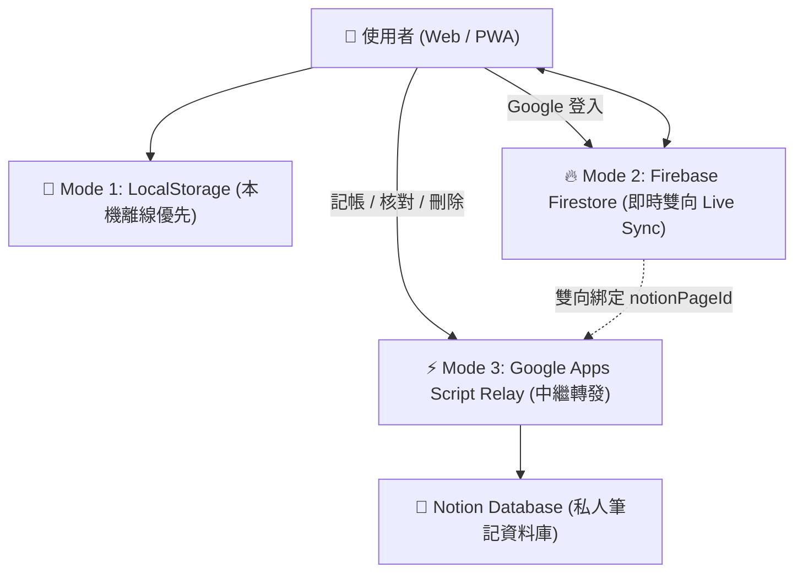
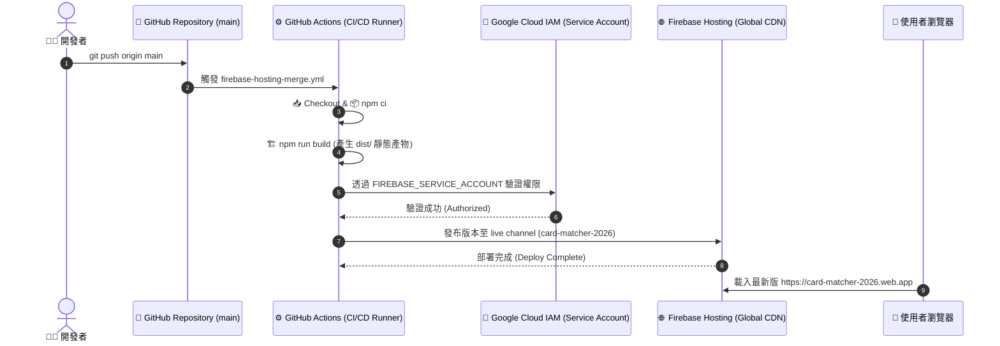

# 💳 2026 信用卡最佳方案與點數查核中心 (Card Matcher)

> 專為 2026 台灣主流信用卡（國泰 CUBE、台新 Richart、玉山 UBear、兆豐 BT21）打造的智慧通路最佳化、即時刷卡記帳、點數回饋核對與銀行客服申訴系統。

🔗 **線上正式環境**：[https://card-matcher-2026.web.app](https://card-matcher-2026.web.app)

---

## 🌟 核心功能亮點

1. **⚡ 即時通路回饋試算與最佳卡片推薦**：
   - 支援特約通路搜尋（如 momo、博客來、Uber Eats、新光三越等），自動比對並推薦當日最高回饋率與方案。
   - 即時計算預期回饋點數（小樹點、台新Point、現金回饋折抵）。
2. **📱 點數記帳與狀態核對（Ledger & Points Tracking）**：
   - 「⚡ 記一筆」快速儲存消費紀錄，標記預期點數與方案。
   - 點數入帳查核（🟡 待核對 ➔ 🟢 已入帳 ➔ 🔴 漏給需申訴）。
3. **📋 一鍵生成銀行客服申訴話術**：
   - 點數短少或未給時，自動比對官方權益公告，產出專業的客服補發申訴文案。

---

## 🏗️ 系統架構與多層次同步模式

系統設計採「離線優先（Offline-First）」搭配「雲端多模式同步」，提供極致靈活的使用者體驗：



### 1. 💾 Mode 1：本機離線優先 (LocalStorage)
- 免註冊、免登入，開箱即用，所有消費紀錄優先存於瀏覽器本機快取。

### 2. 🔥 Mode 2：Google 登入與 Cloud Firestore 即時雲端同步 (Live Sync)
- 點擊「使用 Google 登入」，系統自動將本機紀錄合併遷移至雲端。
- 透過 Firestore `onSnapshot` 實現跨裝置（手機 / 平板 / 電腦）毫秒級即時雙向同步。
- 內建 `firestore.rules` 多租戶安全防護，嚴格限制僅能存取本人帳號資料。

### 3. 📝 Mode 3：Universal Notion GAS Relay（免自架伺服器中繼站）
- **智慧解析網址**：支援直接貼上 Notion 資料庫完整網址（自動解析 32 位元 Database ID）。
- **CORS 完美穿透**：透過 Google Apps Script Serverless 中繼站呼叫 Notion 官方 REST API，實現記帳、修改狀態與刪除（封存）即時連動。
- **雙向 ID 持久化保護**：Notion Page ID 自動回寫至 Firestore，避免競態覆蓋。

---

## 🚀 CI/CD 自動化部署流程架構

專案已配置完整的 GitHub Actions ⇄ Firebase Hosting 自動化部署管道：



### 💡 部署模式說明
- **雲端 CI/CD 自動部署（目前主要途徑）**：
  任何程式碼推播至 `main` 分支時，GitHub Actions 會在雲端 Ubuntu 虛擬機自動完成安裝依賴、建置打包（Vite），並藉由儲存庫 Secret（`FIREBASE_SERVICE_ACCOUNT_CARD_MATCHER_2026`）自動發布至 Firebase CDN。
- **本地手動部署（備用途徑）**：
  亦可在本地開發機執行 `npm run build && npx firebase-tools deploy --only hosting` 直接更新。

---

## 🛠️ 本地開發與常用指令

### 1. 安裝專案依賴
```bash
npm install
```

### 2. 啟動本地開發伺服器
```bash
npm run dev
```
啟動後於瀏覽器開啟 `http://localhost:5173`。

### 3. 本地打包建置
```bash
npm run build
```

### 4. 本地部署至 Firebase Hosting
```bash
npx firebase-tools deploy --only hosting
```

---

## 📂 專案目錄結構

```text
card-matcher/
├── .github/
│   └── workflows/
│       └── firebase-hosting-merge.yml  # GitHub Actions Firebase 自動化 CI/CD
├── firestore.rules                     # Cloud Firestore 多租戶安全存取規則
├── firebase.json                       # Firebase Hosting 與環境配置
├── gas-backend/
│   └── Code.gs                         # Google Apps Script Universal Notion Relay 後端
├── src/
│   ├── js/
│   │   ├── cards-data.js               # 2026 信用卡方案與通路權益規則庫
│   │   ├── firebase.js                 # Firebase Auth & Firestore 雲端即時同步核心
│   │   ├── store.js                    # 使用者偏好設定與 LocalStorage 管理
│   │   ├── tracker.js                  # 刷卡記帳、回饋試算與狀態同步邏輯
│   │   └── ui.js                       # 前端 UI 互動與事件監聽
│   └── css/
│       └── style.css                   # 深色質感現代化 CSS 樣式
├── index.html                          # 主網頁應用程式入口
└── vite.config.js                      # Vite 建置配置
```

---

## 📄 授權條款
MIT License © 2026 Card Matcher Team
