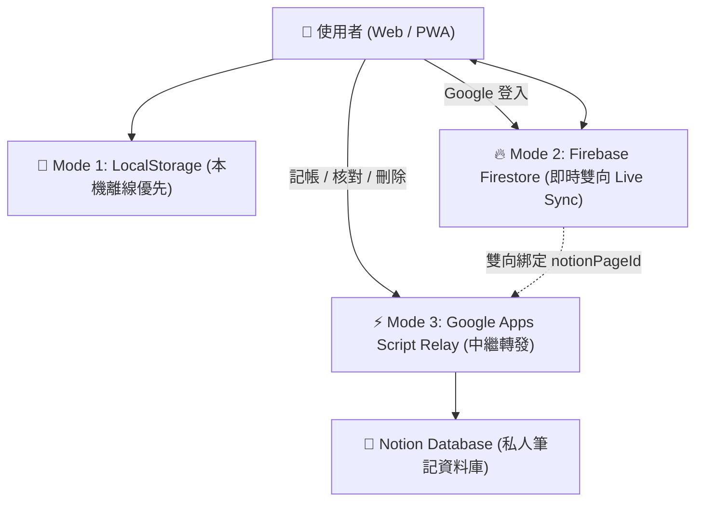
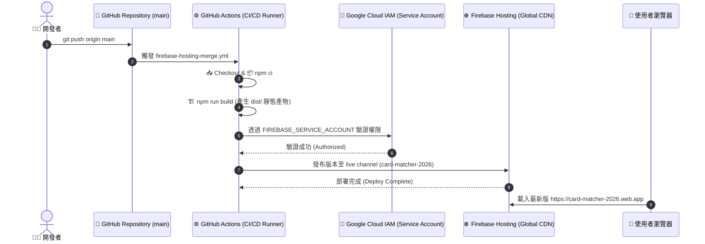
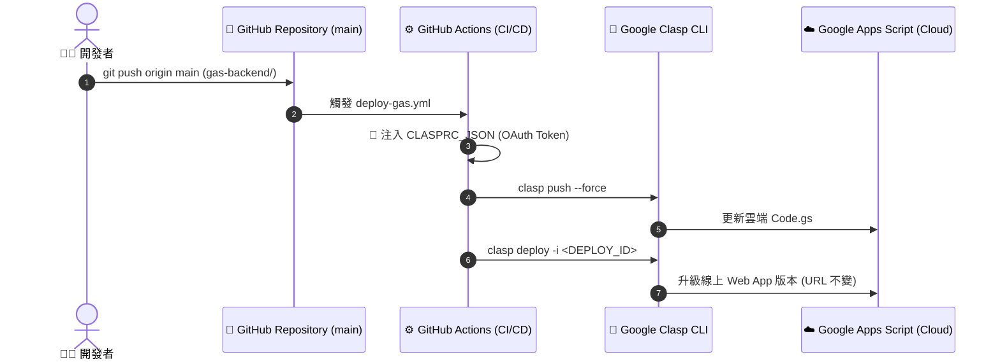

# 💳 2026 信用卡最佳方案與點數查核中心 (Card Matcher)

> 專為 2026 台灣主流信用卡（國泰 CUBE、台新 Richart、玉山 UBear、兆豐 BT21）打造的智慧通路最佳化、即時刷卡記帳、點數回饋核對與銀行客服申訴系統。

🔗 **線上正式環境**：[https://card-matcher-2026.web.app](https://card-matcher-2026.web.app)

---

## 🌟 核心功能亮點

1. **🎨 Taste Skill v2 靜奢冷淡風 (Quiet Luxury) 設計**：
   - 採用高級黑曜石夜間模式 (`#0F1217`) 與純淨象牙白日間模式 (`#F6F8FA`)，點綴鼠尾草翡翠綠 (`#10B981`) 與香檳琥珀 (`#D97706`)。
   - 0ms 零延遲主題秒切換，極致流暢 60fps 體驗。
2. **🎛️ 單一入口整合式個人檔案膠囊與二級選單**：
   - 頂部導覽列整合 Google 帳號狀態與持卡設定，點擊膠囊按鈕展開二級下拉功能清單（卡片等級、開發日誌、專案介紹、連線診斷、Google 快速登入/登出）。
3. **⚡ 即時通路回饋試算與最佳卡片推薦**：
   - 支援 100+ 特約通路搜尋（momo、博客來、Uber Eats、新光三越、超商等），自動精算出當日最高回饋率與切換方案。
   - MCC 特店防呆避坑警語與最優支付路徑提示。
4. **📱 智慧記帳與點數核對（Ledger & Points Tracking）**：
   - 「⚡ 記一筆」自動動態分析歷史消費紀錄，智慧挑選個人最高頻 Top 5 店家與金額一鍵快速帶入。
   - 點數入帳查核（🟡 待核對 ➔ 🟢 已入帳 ➔ 🔴 漏給需申訴）。
5. **🚪 帳號防呆與 Google 雲端即時同步 (Live Sync)**：
   - 登入 Google 帳號後，所有手機與電腦秒級雙向同步。
   - 貼心防呆：登出二次確認彈窗，防止誤觸登出。
6. **📜 內建開發日誌 (Changelog) 時間軸**：
   - 選單內建完整版本演進時間軸，離線 0ms 瞬間查看歷代功能更新與修復明細。
7. **📋 一鍵生成銀行客服申訴話術**：
   - 點數短少或未給時，自動比對官方權益公告，產出專業的客服補發申訴文案。

---

## 🏗️ 系統架構與多層次同步模式

系統設計採「離線優先（Offline-First）」搭配「雲端多模式同步」，提供極致靈活的使用者體驗：



### 1. 💾 Mode 1：本機離線優先 (LocalStorage)
- 免註冊、免登入，開箱即用，所有消費紀錄優先存於瀏覽器本機快取。

### 2. 🔥 Mode 2：Google 登入與 Cloud Firestore 即時雲端同步 (Live Sync)
- 點擊「使用 Google 登入」，系統自動將本機紀錄合併遷移至雲端。
- 透過 Firestore `onSnapshot` 實現跨裝置（手機 / 平板 / 電腦）毫秒級即時雙向同步。
- 內建 `firestore.rules` 多租戶安全防護，嚴格限制僅能存取本人帳號資料。

### 3. 📝 Mode 3：Universal Notion GAS Relay（免自架伺服器中繼站）
- **智慧解析網址**：支援直接貼上 Notion 資料庫完整網址（自動解析 32 位元 Database ID）。
- **CORS 完美穿透**：透過 Google Apps Script Serverless 中繼站呼叫 Notion 官方 REST API，實現記帳、修改狀態與刪除（封存）即時連動。
- **雙向 ID 持久化保護**：Notion Page ID 自動回寫至 Firestore，避免競態覆蓋。

---

## 🚀 CI/CD 自動化部署流程架構

專案已配置完整的 GitHub Actions ⇄ Firebase Hosting 自動化部署管道：



### 💡 雙軌 CI/CD 部署模式說明
- **前端 (Firebase Hosting)**：
  任何程式碼推播至 `main` 分支時，GitHub Actions 自動建置打包（Vite），並藉由儲存庫 Secret（`FIREBASE_SERVICE_ACCOUNT_CARD_MATCHER_2026`）自動發布至 Firebase 全球 CDN。
- **後端 (Google Apps Script / Clasp)**：
  當 `gas-backend/` 目錄有異動時，GitHub Actions 觸發 `deploy-gas.yml`，透過 `@google/clasp` 與 GitHub Secret（`CLASPRC_JSON`）自動將程式碼同步上傳（`clasp push`）並發布至既有 Webhook 部署（`clasp deploy`），免手動複製貼上！



---

## 🛠️ 本地開發與常用指令

### 1. 安裝專案依賴
```bash
npm install
```

### 2. 啟動本地開發伺服器
```bash
npm run dev
```
啟動後於瀏覽器開啟 `http://localhost:5173`。

### 3. 本地打包建置
```bash
npm run build
```

### 4. 本地部署至 Firebase Hosting
```bash
npx firebase-tools deploy --only hosting
```

### 5. Google Apps Script (`clasp`) 本地管理
```bash
# 登入 Google 帳號 (首次需登入)
npx @google/clasp login

# 將本地 gas-backend/ 程式碼推送到 Google 雲端
cd gas-backend && npx @google/clasp push

# 部署新版本至既有 Webhook (保持 URL 不變)
npx @google/clasp deploy -i <DEPLOYMENT_ID> -d "Release Description"
```

---

## 📖 專案文件與開發歷程

- 📜 **[從 0 到 1 完整開發歷程與架構演進史 (Development Journey)](./docs/development-journey.md)**：包含各階段架構演進、技術瓶頸攻堅與 ADR 架構決策記錄。
- 📊 **[Notion 資料庫欄位結構與定義 (Database Schema)](./docs/database-schema.md)**：包含特約店家與記帳對帳庫詳細欄位規格。
- ⚙️ **[Notion 整合與金鑰設定手冊 (Notion Setup Guide)](./docs/notion-setup-guide.md)**：Notion API 金鑰與資料庫分享教學。
- ⚡ **[GAS 後端專屬設定手冊 (GAS Backend README)](./gas-backend/README.md)**：Google Apps Script 與 clasp 部署指引。

---

## 🔗 雲端服務控制台與外部工具資源庫 (Cloud Consoles & Tool URLs)

### 1. 🌐 線上產品與代碼庫
- **線上正式環境**：[https://card-matcher-2026.web.app](https://card-matcher-2026.web.app)
- **GitHub 原始碼庫**：[https://github.com/Tommy95271/card-matcher](https://github.com/Tommy95271/card-matcher)
- **GitHub Actions CI/CD**：[https://github.com/Tommy95271/card-matcher/actions](https://github.com/Tommy95271/card-matcher/actions)
- **GitHub Secrets 管理**：[https://github.com/Tommy95271/card-matcher/settings/secrets/actions](https://github.com/Tommy95271/card-matcher/settings/secrets/actions)

### 2. 🔥 Firebase & Google Cloud
- **Firebase 主控制台**：[https://console.firebase.google.com/project/card-matcher-2026/overview](https://console.firebase.google.com/project/card-matcher-2026/overview)
- **Firebase 身份驗證 (Auth)**：[https://console.firebase.google.com/project/card-matcher-2026/authentication/users](https://console.firebase.google.com/project/card-matcher-2026/authentication/users)
- **Cloud Firestore 資料庫**：[https://console.firebase.google.com/project/card-matcher-2026/firestore](https://console.firebase.google.com/project/card-matcher-2026/firestore)
- **Firebase Hosting 託管發布**：[https://console.firebase.google.com/project/card-matcher-2026/hosting](https://console.firebase.google.com/project/card-matcher-2026/hosting)
- **GCP IAM 服務帳號**：[https://console.cloud.google.com/iam-admin/serviceaccounts?project=card-matcher-2026](https://console.cloud.google.com/iam-admin/serviceaccounts?project=card-matcher-2026)

### 3. ⚡ Google Apps Script & Clasp
- **Google Apps Script 雲端專案編輯器**：[https://script.google.com/d/1sfiLrrxSj7vkVbLJDknk4r1F5yLPS0EBU6uEaCdIggdIt3nwB-XPd-c7/edit](https://script.google.com/d/1sfiLrrxSj7vkVbLJDknk4r1F5yLPS0EBU6uEaCdIggdIt3nwB-XPd-c7/edit)
- **Google Apps Script API 權限設定 (使用 clasp 前必開)**：[https://script.google.com/home/usersettings](https://script.google.com/home/usersettings)
- **GAS 儀表板總覽**：[https://script.google.com/home](https://script.google.com/home)
- **Google `@google/clasp` 官方 NPM**：[https://www.npmjs.com/package/@google/clasp](https://www.npmjs.com/package/@google/clasp)
- **Google `clasp` 官方 GitHub**：[https://github.com/google/clasp](https://github.com/google/clasp)

### 4. 📝 Notion 開發者資源
- **Notion 內部整合管理 (API Keys)**：[https://www.notion.so/profile/integrations](https://www.notion.so/profile/integrations)
- **Notion API 官方文件**：[https://developers.notion.com/reference/intro](https://developers.notion.com/reference/intro)

---

## 📂 專案目錄結構

```text
card-matcher/
├── .github/
│   └── workflows/
│       └── firebase-hosting-merge.yml  # GitHub Actions Firebase 自動化 CI/CD
├── docs/
│   ├── development-journey.md          # 完整開發歷程與架構演進史 (ADR)
│   ├── database-schema.md              # 資料庫規格與欄位定義
│   └── notion-setup-guide.md           # Notion 整合與金鑰手冊
├── firestore.rules                     # Cloud Firestore 多租戶安全存取規則
├── firebase.json                       # Firebase Hosting 與環境配置
├── gas-backend/
│   └── Code.gs                         # Google Apps Script Universal Notion Relay 後端
├── src/
│   ├── data/
│   │   └── changelog.js                # 系統版本演進與發布更新日誌資料庫
│   ├── js/
│   │   ├── cards-data.js               # 2026 信用卡方案與通路權益規則庫
│   │   ├── firebase.js                 # Firebase Auth & Firestore 雲端即時同步核心
│   │   ├── store.js                    # 使用者偏好設定與 LocalStorage 管理
│   │   ├── tracker.js                  # 刷卡記帳、回饋試算與狀態同步邏輯
│   │   ├── logger.js                   # 即時同步除錯日誌與健康診斷器
│   │   └── ui.js                       # 前端 UI 互動與事件監聽
│   └── css/
│       ├── main.css                    # 主框架與 RWD 佈局樣式
│       ├── components.css              # 各組件、時間軸與卡片樣式
│       ├── variables.css               # 靜奢冷淡風 (Quiet Luxury) 設計系統變數
│       └── reset.css                   # CSS 重置與 0ms 主題切換樣式
├── index.html                          # 主網頁應用程式入口
└── vite.config.js                      # Vite 建置配置
```

---

## 📄 授權條款
MIT License © 2026 Card Matcher Team
