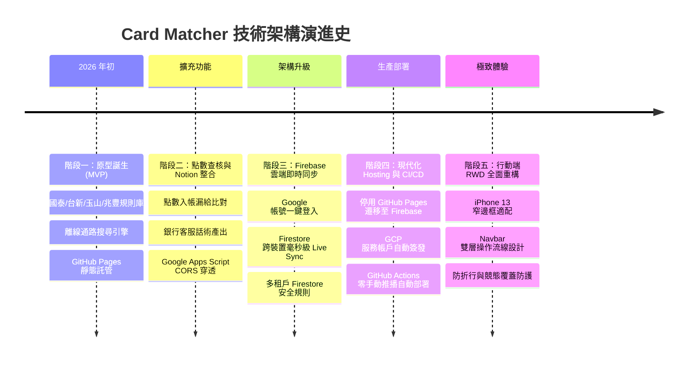
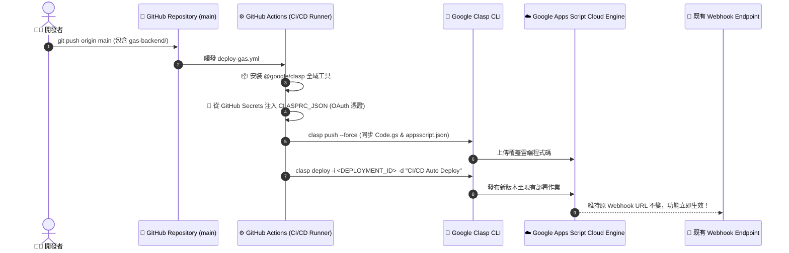

# 📖 2026 信用卡方案速查系統：從 0 到 1 完整開發歷程與架構演進史 (Development Journey)

> 本文件完整記錄《2026 信用卡最佳方案與點數查核中心 (Card Matcher)》從最初構想、原型建置、技術瓶頸突破、架構演進至現代化雲端 CI/CD 的全流程。

---

## 🧭 專案演進里程碑總覽 (Milestones Timeline)

---

## 📑 第一階段：需求起源與前端原型 (MVP)

### 1.1 背景痛點
- 2026 年台灣主流權益切換型信用卡（國泰世華 CUBE 卡、台新 Richart 卡、玉山 UBear、兆豐宇宙明星 BT21）權益複雜。
- 使用者在結帳當下無法即時得知哪張卡回饋最高、當天方案是否需切換。

### 1.2 技術選型與實作
- **核心架構**：原生現代 JavaScript (ES Modules) + Vanilla CSS + Vite。
- **資料層**：建立結構化特約店家與權益規則資料庫（`src/js/cards-data.js`）。
- **推薦演算法**：
  - 輸入店家關鍵字（如「博客來」、「全聯」、「UberEats」）。
  - 自動比對所有持卡方案，計算即時回饋率，並提示「今日方案鎖定狀態」。
- **初期託管**：使用 GitHub Pages（`tommy95271.github.io/card-matcher`）進行快速靜態展示。

---

## 📝 第二階段：點數對帳需求與 Notion 資料庫整合 (Mode 3)

### 2.1 痛點：銀行點數常常漏給、少算
- 方案回饋通常於刷卡後數日或次月入帳，使用者經常忘記當初是切換成何種方案消費，導致權益縮水卻渾然不知。

### 2.2 創新設計：點數查核與客服申訴話術
1. **記帳與試算引擎**：記錄「消費金額」、「適用方案」、「預期回饋點數」（小樹點、台新Point、現金回饋）。
2. **查核三態**：`🟡 待核對` ➔ `🟢 已入帳` ➔ `🔴 漏給需申訴`。
3. **自動申訴文案生成器**：比對官方公告與漏給差額，自動產出可直接複製寄給銀行客服的申訴話術。

### 2.3 技術瓶頸與解決方案：Notion API 與 CORS 限制
- **問題**：瀏覽器前端因 CORS 限制無法直接呼叫 Notion 官方 API；且一般使用者不願意自行架設 Node.js 伺服器。
- **解決方案（Universal Notion GAS Relay）**：
  - 開發 Google Apps Script (GAS) Serverless 中繼後端（`gas-backend/Code.gs`）。
  - 提供公開 Webhook 端點，支援前端動態傳入 `notionApiKey` 與 `notionDbId`。
  - 實作「智慧網址解析」：使用者直接貼上 Notion 完整資料庫 URL，系統自動正則萃取 32 位元 Database ID。
  - 支援 `add_expense`、`update_status`、`delete_expense` 與 `fetch_expenses` 全生命週期連動。

---

## 🔥 第三階段：零設定多裝置雲端即時同步 (Mode 2)

### 3.1 痛點：免設 Notion Key 的大眾用戶同步需求
- 部份一般使用者不熟悉 Notion API Token 的申請流程，但仍需要手機、平板、電腦無縫同步帳本。

### 3.2 Firebase Authentication + Cloud Firestore 架構
- **Google 一鍵登入**：串接 Firebase Client SDK，登入即用。
- **即時雙向監聽（Live Sync）**：
  - 使用 Firestore `onSnapshot` 監聽 `users/{uid}/expenses` 集合，任何裝置新增、修改或刪除，其餘裝置毫秒級自動更新。
- **離線優先與自動遷移**：
  - 未登入前的本機紀錄，於登入瞬間自動透過 Firestore Batch 遷移至雲端。
- **多租戶安全防護**：
  - 撰寫嚴格的 `firestore.rules`，限制僅有本人 (`request.auth.uid == userId`) 具備讀寫權限。

### 3.3 核心技術攻堅：競態條件（Race Condition）與雙向 ID 持久化
- **問題**：Firestore 快速同步會覆蓋正在等待 Notion 回傳的 `notionPageId`，導致後續「修改狀態」與「刪除」無法對應到 Notion 卡片。
- **修復機制**：
  1. Firestore Live Sync 合併時加入保護鎖，絕不以遠端空值覆蓋本機已存在的 `notionPageId`。
  2. Notion 建立完成後立即回寫更新 Firestore 節點。
  3. 修改狀態時若發現無 ID，觸發智慧補償同步，確保雙向資料庫 100% 一致。

---

## 🚀 第四階段：生產架構遷移與 GitHub Actions CI/CD (Mode 4)

### 4.1 為什麼從 GitHub Pages 遷往 Firebase Hosting？
| 比較面向 | GitHub Pages (舊) | Firebase Hosting (新) |
| :--- | :--- | :--- |
| **網域名稱與品牌** | 子目錄 `/card-matcher/`（易有 SPA 路由 base 錯誤） | 獨立專屬網域 `card-matcher-2026.web.app` |
| **全端生態系** | 僅支援靜態檔案託管 | 與 Firebase Auth / Firestore 同屬一體，極速同源存取 |
| **CDN 快取與速度** | 基礎全球快取 | Google 全球 Edge CDN 加速與自動 SSL 證書管理 |
| **PWA 與快取支援** | 需手動調整 Service Worker 路徑 | 原生支援 Root Scope 與乾淨 URL Rewrites |

### 4.2 GitHub Actions ⇄ Firebase Hosting 自動化部署管道
- 移除舊的 `deploy.yml`（GitHub Pages）。
- 建立 Google Cloud IAM 服務帳號（`firebase-adminsdk-fbsvc`），簽發私密金鑰並以 Libsodium 加密寫入 GitHub Secrets（`FIREBASE_SERVICE_ACCOUNT_CARD_MATCHER_2026`）。
- 建立 `.github/workflows/firebase-hosting-merge.yml`：
  - 只要 `git push origin main`，GitHub Actions 雲端虛擬機全自動執行 `npm ci` ➔ `npm run build` ➔ `Firebase Hosting Deploy`。

### 4.3 GitHub Actions ⇄ Google Apps Script (Clasp) 自動化部署管道

#### 什麼是 `clasp`？
**`clasp`**（**C**ommand **L**ine **A**pps **S**cript **P**rojects）是 Google 官方推出的指令列工具，專門用來解決 Google Apps Script 傳統只能在網頁編輯器手動修改、無法與 Git 結合的痛點。

#### 核心優勢與效益：
1. **本機代碼管理與 Git 整合**：所有後端邏輯（`Code.gs`、`appsscript.json`）均納入 Git 進行精確版本追蹤。
2. **自動化 OAuth 憑證注入**：本機執行一次 `clasp login` 產生 `~/.clasprc.json` 後，將憑證加密寫入 GitHub Secrets（`CLASPRC_JSON`），讓雲端 Runner 具備合法發布權限。
3. **無感升級 (Zero-Downtime Deployment)**：指定部署 ID (`clasp deploy -i ...`) 讓 Webhook URL 永遠維持同一串網址，前端 `localStorage` 完全無需更動設定。

---

## 📱 第五階段：行動端 RWD 極致適配 (iPhone 13 窄螢幕最佳化)

### 5.1 痛點分析
- iPhone 13（寬度 390px）等行動裝置在直向瀏覽時：
  - 頂部導覽列按鈕過多，將左側「信用卡方案速查」標題擠壓成垂直單字折行。
  - 右側工具列超出螢幕，造成 X 軸橫向溢出滑動。
  - 卡片內「👑 首選推薦卡片」與「⚡ 記一筆」按鈕文字折行。

### 5.2 響應式佈局重構方案
1. **Header 雙層流線設計**：
   - **第一層**：品牌標題（鎖定 `white-space: nowrap`）＋ Google 帳號頭像 ＋ 深淺色切換 🌙 ＋ 設定 ⚙️。
   - **第二層**：全寬重點操作按鈕列 📊「對帳查核中心」與 ➕「記一筆」，提供宛如 iOS 原生金融 App 的觸控體驗。
2. **防折行排版（Nowrap Protection）**：
   - 所有標籤與按鈕全面加入 `flex-shrink: 0` 與 `white-space: nowrap`，徹底根除跑版問題。

---

## ⚡ 第六階段：常用消費智慧範本、全域快捷鍵與 PWA 無感熱更新

### 6.1 痛點分析
- **記帳步驟冗長**：每次記錄常去通路（如 Uber Eats、全聯、中油、星巴克）都需要重複輸入名稱、金額與選擇方案。
- **手機 PWA 每次更新必須手動重開**：Service Worker 快取雖然能加速載入，但在手機安裝為 PWA 後，常因為舊 Worker 持續控制頁面，使用者必須手動殺掉 App 重開才能吃到最新版本。

### 6.2 最佳化解決方案
1. **常用消費快速範本 (Quick Preset Chips)**：
   - 在「⚡ 快速記一筆」彈窗頂部加入常用快捷膠囊（`🍱 Uber Eats $250`、`🛒 全聯 $500`、`⛽ 中油 $1000`、`☕ 星巴克 $165`、`📦 momo $1200`、`🏪 7-11 $120`、`📚 博客來 $650`）。
   - 點擊後 1 秒自動帶入店家、金額、備註，並觸發智慧比對演算法自動選取回饋率最高之卡片方案。
2. **PWA 即時無感版本熱更新 (Instant Zero-Restart PWA Updates)**：
   - Service Worker 支援 `SKIP_WAITING` 訊息接管指令。
   - 監聽 `visibilitychange`（使用者切換回 App 前景時主動檢查）與 `updatefound` 事件。
   - 當 GitHub Actions 發布新版本時，首頁自動彈出 **「🚀 發現新版本更新！[⚡ 立即套用]」** 浮動橫幅，使用者點擊即可無感熱重載套用最新功能，徹底告別殺 App 重開的困擾！
3. **Power-User 全域鍵盤快捷鍵**：
   - `/`：快速聚焦搜尋框。
   - `N`：快速開啟「⚡ 記一筆」記帳彈窗。
   - `T` / `L`：快速開啟「📊 點數對帳查核中心」。
   - `Escape`：一鍵關閉所有開啟中的彈窗。

---

## 🎯 架構決策記錄 (Architecture Decision Records, ADR)

### ADR-001: 為什麼選擇 Vanilla JS + Vite 而非 React / Vue / Angular？
- **背景**：需要打造反應敏捷、載入極速的行動端工具型 Web App。
- **決策**：採用原生現代 JavaScript (ES Modules) + 原生 CSS，搭配 Vite 作為建置工具。
- **效益**：
  1. **零執行時負擔（Zero Runtime Overhead）**：無需載入數百 KB 的框架底層代碼，手機載入時間縮短至 0.2 秒以內。
  2. **毫秒級熱更新 (HMR)**：Vite 利用瀏覽器原生模組，存檔即瞬間更新。
  3. **長期穩定性**：遵循原生 Web 標準，永無框架大版本升級斷代或廢棄 API 的維護風險。

---

### ADR-002: 為什麼選擇 Cloud Firestore 而非舊版 Firebase Realtime Database？
- **背景**：需要儲存使用者的多筆消費與對帳狀態，並支援即時雙向推播。
- **決策**：選用 Google 主推的新一代 NoSQL 資料庫 **Cloud Firestore**。
- **效益**：
  1. **文件/集合階層架構**：天然支援多租戶隔離（`users/{uid}/expenses/{id}`），結構遠比單一龐大 JSON 樹清晰。
  2. **複合查詢與排序**：原生支援同時依「日期倒序 + 狀態篩選」複合檢索（`orderBy('date', 'desc')`）。
  3. **台灣在地機房 (`asia-east1`)**：伺服器位於彰化，延遲極低、存取極速。
  4. **細粒度安全規則**：透過 `firestore.rules` 嚴格限制 `request.auth.uid == userId`。

---

### ADR-003: 為什麼選擇 Google Apps Script (GAS) 作為 Notion Relay 而非 Firebase Cloud Functions？
- **背景**：Notion REST API 不允許瀏覽器前端跨域發送請求 (CORS)，必須透過伺服器端中繼轉發。
- **決策**：採用 Google Apps Script Web App 伺服器中繼站。
- **效益**：
  1. **100% 永久零成本且免綁信用卡**：Firebase Cloud Functions 要求專案升級為 Blaze 方案（必須綁定信用卡）才能對外連網呼叫 Notion API；而 GAS 免綁卡、完全免費。
  2. **開源與他人複製門檻極低**：一般朋友或社群使用者只需複製程式碼即可免費部署自己的中繼站，不需至 GCP 註冊開發者帳號。
  3. **免伺服器維護**：Google 自動託管，具備極高可用性。

---

### ADR-004: 為什麼採用雙軌同步策略（Firestore + Notion）？
- **背景**：大眾用戶追求「免申請 Token、0 門檻跨裝置同步」；進階用戶追求「資料完全掌握在私人 Notion」。
- **決策**：設計可獨立運作亦可並行雙向寫入的架構。
- **效益**：
  1. 登入 Google 即可享有 Firestore 毫秒級跨裝置即時同步。
  2. 貼上 Notion 資料庫網址即可備份至個人筆記庫。
  3. 實作雙向 ID 持久化保護鎖，避免 Firestore 與 Notion 異步寫入時發生競態覆蓋。

---

### ADR-005: 為什麼將託管從 GitHub Pages 遷移至 Firebase Hosting？
- **背景**：GitHub Pages 採用子目錄二級網址，且無法與 Firebase 生態系無縫整合。
- **決策**：遷移至 Firebase Hosting。
- **效益**：
  1. **專屬獨立根網域**：提供乾淨頂層網域（`card-matcher-2026.web.app`），徹底解決 SPA 路由 Base 路徑問題。
  2. **同源 Edge CDN 邊緣加速**：與 Firebase Auth / Firestore 同處 Google 全球骨幹網路，快取與存取速度顯著提升。
  3. **自動化 CI/CD**：透過 Google Cloud IAM Service Account 與 GitHub Actions，達成 `git push` 即全自動建置發布。

---

### ADR-006: 為什麼引入 Google clasp 實現 Google Apps Script 的 CI/CD 自動化？
- **背景**：GAS 傳統開發必須手動開啟瀏覽器網頁編輯器複製貼上程式碼，無法進行本地 VSCode 開發、Git 版本控管，且容易在手動發布新版本時產生人為疏失或忘記更新部署版本。
- **決策**：引入 Google 官方 `@google/clasp` CLI 工具，並在 GitHub Actions 配置 `deploy-gas.yml`。
- **效益**：
  1. **程式碼即基礎設施 (Code as Single Source of Truth)**：`gas-backend/Code.gs` 與 `appsscript.json` 本地化，每一次修改均受 Git Commit 嚴密追蹤。
  2. **雙軌一鍵自動化發布**：只要 `git push origin main`，前端自動發布至 Firebase Hosting，後端 GAS 自動透過 `clasp push` 與 `clasp deploy` 發布至 Google 雲端。
  3. **固定 Webhook URL (Zero Reconfiguration)**：透過指定原有 Deployment ID，自動升級線上 Web App 版本，使用者既有的 Webhook URL 永遠無需重新設定。

---

### ADR-007: 為什麼採用 PWA Service Worker 監聽與 SKIP_WAITING 熱更新機制？
- **背景**：PWA 預設由 Service Worker 快取所有靜態資源，當伺服器發布新版本時，舊 Worker 仍會鎖定頁面，造成行動端必須手動強制重啟 App 才能吃到最新程式碼。
- **決策**：整合 `visibilitychange` 與 `SKIP_WAITING` 雙向通知機制，搭配專屬更新橫幅。
- **效益**：
  1. **無感更新體驗**：切換回 App 即主動向雲端查詢版本差異。
  2. **主動提示**：使用者點擊「立即套用」即瞬間刷新，無需關閉重開手機 App。

---

### ADR-008: 為什麼導入 Taste Skill v2 (Quiet Luxury 靜奢冷淡風) 與 0ms 主題秒切換？
- **背景**：過往介面充斥高飽和霓虹光暈與大面積漸層紫，視覺負擔大且缺乏沉穩信任感；此外多層 `backdrop-filter: blur(16px)` 在切換主題時引發 GPU 連續重算，造成切換延遲卡頓。
- **決策**：全面導入 **Taste Skill v2** 規範，建立「黑曜石夜間 (#0F1217) + 象牙白日間 (#F6F8FA)」低調奢華色系，並藉由 `html.theme-switching` 在切換瞬間短暫抑制全局 transition。
- **效益**：
  1. **低調典雅美學**：1px 啞光邊框、鼠尾草翡翠綠 (`#10B981`) 與香檳琥珀 (`#D97706`)，營造耐看且專業的金融工具視覺。
  2. **極致流暢度**：0ms 零感知 60fps 主題秒切換，徹底消除閃爍與卡頓。

---

### ADR-009: 為什麼建立專案內建結構化開發日誌 (Changelog) 與智慧常用帶入？
- **背景**：使用者頻繁在日常固定店家（如 7-11、全聯、Uber Eats）消費，每次手動重新輸入品項與方案降低記帳意願；同時系統歷代更新與改版細節缺乏透明直觀的呈現管道。
- **決策**：
  1. 「記一筆」實作動態頻率演算法，自動計算使用者最高頻的 Top 5 消費店家與卡片組合。
  2. 建立專案內建結構化 `src/data/changelog.js`，並於設定頁面提供專屬時間軸彈窗 (`#changelog-modal`)。
- **效益**：
  1. **1秒秒速記帳**：一鍵帶入常用店家與最優回饋方案，大幅降低記帳操作摩擦力。
  2. **0ms 離線透明日誌**：不依賴第三方 API，隨時隨地可離線查看完整版本演進歷史。

---

### ADR-010: 為什麼將頂部導覽列設定與帳號狀態整合為單一入口個人膠囊與二級選單？
- **背景**：頂部導覽列原本並存 Google 登入按鈕、個人頭像膠囊、主題切換與 ⚙️ 設定按鈕，造成小螢幕手機版面過度擁擠且功能入口分散。
- **決策**：將帳號狀態與所有系統設定整合成單一 **個人檔案膠囊按鈕 (`#profile-menu-trigger`)**，點擊後展開精緻二級下拉選單 (`#profile-dropdown-menu`)。
- **效益**：
  1. **視覺層次極度清爽**：頂部右側僅保留 `[☀️/🌙] [👤 個人膠囊 ▾]` 兩個入口，大幅提升極簡美感與操作聚焦度。
  2. **結構化功能歸納**：持卡設定、開發日誌、專案介紹、同步除錯與 Google 登入/登出統一收納於二級選單，階層分明且易於維護。
  3. **Taste Skill v2 沉浸動效**：支援浮層進場微動畫、點擊外部關閉與 Escape 鍵關閉，操作體驗細緻流暢。

---

### ADR-011: 為什麼進行「介面去噪點」與「方案鎖定微膠囊化」？
- **背景**：過度堆砌的裝飾性 Emoji（如分類上的 `🏪 🛒 💻`）與龐大的方案鎖定狀態條造成第一屏資訊過載，產生典型 AI 雜亂感，模糊了「秒查回饋」的核心任務。
- **決策**：
  1. 分類列與按鈕純文字微膠囊化，採用 Quiet Luxury 典雅配色（翡翠綠、香檳金、黑曜石、象牙白），告別廉價 AI 感。
  2. 將今日方案鎖定重構為搜尋框下方的精緻微膠囊列 (`.today-capsule-bar`)。
  3. 堅持維持並強化「⚠️ 避坑防呆警語」的高對比醒目度，確保關鍵限制不被使用者忽略。
- **效益**：
  1. **大幅提升視覺呼吸感**：首頁主次階層鮮明，90% 注意力聚焦於搜尋與推薦。
  2. **專業典雅工具質感**：消除花俏幼稚的視覺雜訊，呈現現代金融工具的極致洗鍊感。

---

## 🔮 未來演進路線圖 (Future Roadmap / TODO List)

- [ ] **Option 1: 對帳中心統計圖表與月度報表 (Analytics Dashboard)**：在對帳中心頂部提供當月累積刷卡額、各卡別點數小計（小樹點/台新Point/現金折抵）與入帳率進度條。
- [ ] **Option 3: Notion 連線健檢診斷器 (Notion Schema Doctor)**：在設定頁面提供一鍵檢測 Notion 資料庫結構與欄位名稱/型態是否齊全相容。
- [ ] **Option 4: 離線累積批次重試同步 (Batch Sync Retry)**：提供一鍵補傳所有未同步至 Notion 的歷史記帳紀錄。
- [ ] **Option 5: 記帳資料匯出 CSV / Excel**：提供匯出功能，讓純本地端或 Firestore 使用者一鍵備份對帳明細。

---

## 📊 專案關鍵資源與工具控制台清單 (Key Resources & Tool URLs)

### 1. 🌐 線上產品與代碼庫
| 資源名稱 | 說明 | 連結 URL |
| :--- | :--- | :--- |
| **正式環境 App** | Firebase CDN 全球線上正式站 | [https://card-matcher-2026.web.app](https://card-matcher-2026.web.app) |
| **GitHub 儲存庫** | 原始碼管理 | [https://github.com/Tommy95271/card-matcher](https://github.com/Tommy95271/card-matcher) |
| **GitHub Actions** | CI/CD 自動化建置與雙軌發布工作流 | [https://github.com/Tommy95271/card-matcher/actions](https://github.com/Tommy95271/card-matcher/actions) |
| **GitHub Secrets** | CI/CD 憑證管理 (`FIREBASE_SERVICE_ACCOUNT` / `CLASPRC_JSON`) | [https://github.com/Tommy95271/card-matcher/settings/secrets/actions](https://github.com/Tommy95271/card-matcher/settings/secrets/actions) |

### 2. 🔥 Firebase & Google Cloud
| 資源名稱 | 說明 | 連結 URL |
| :--- | :--- | :--- |
| **Firebase 專案主頁** | Firebase 主控台儀表板 | [https://console.firebase.google.com/project/card-matcher-2026/overview](https://console.firebase.google.com/project/card-matcher-2026/overview) |
| **Firebase Auth** | Google 帳號授權與使用者名單 | [https://console.firebase.google.com/project/card-matcher-2026/authentication/users](https://console.firebase.google.com/project/card-matcher-2026/authentication/users) |
| **Cloud Firestore** | 即時 NoSQL 資料庫 (`users/{uid}/expenses`) | [https://console.firebase.google.com/project/card-matcher-2026/firestore](https://console.firebase.google.com/project/card-matcher-2026/firestore) |
| **Firebase Hosting** | 靜態網站 CDN 託管與版本歷程 | [https://console.firebase.google.com/project/card-matcher-2026/hosting](https://console.firebase.google.com/project/card-matcher-2026/hosting) |
| **GCP IAM 服務帳號** | CI/CD 服務帳號金鑰管理 | [https://console.cloud.google.com/iam-admin/serviceaccounts?project=card-matcher-2026](https://console.cloud.google.com/iam-admin/serviceaccounts?project=card-matcher-2026) |

### 3. ⚡ Google Apps Script & Clasp
| 資源名稱 | 說明 | 連結 URL |
| :--- | :--- | :--- |
| **GAS 雲端專案編輯器** | 線上檢視 Code.gs 與執行紀錄日誌 | [https://script.google.com/d/1sfiLrrxSj7vkVbLJDknk4r1F5yLPS0EBU6uEaCdIggdIt3nwB-XPd-c7/edit](https://script.google.com/d/1sfiLrrxSj7vkVbLJDknk4r1F5yLPS0EBU6uEaCdIggdIt3nwB-XPd-c7/edit) |
| **GAS 專案儀表板** | Google Apps Script 個人專案列表 | [https://script.google.com/home](https://script.google.com/home) |
| **GAS API 設定開關** | 使用 clasp 前**必須開啟**的 API 權限 | [https://script.google.com/home/usersettings](https://script.google.com/home/usersettings) |
| **Google Clasp NPM** | `@google/clasp` 官方 NPM 套件 | [https://www.npmjs.com/package/@google/clasp](https://www.npmjs.com/package/@google/clasp) |
| **Google Clasp GitHub** | Google 官方 `clasp` 原始碼倉庫 | [https://github.com/google/clasp](https://github.com/google/clasp) |

### 4. 📝 Notion 開發者資源
| 資源名稱 | 說明 | 連結 URL |
| :--- | :--- | :--- |
| **Notion 內部整合管理** | 申請、檢視與管理 Notion API 金鑰 | [https://www.notion.so/profile/integrations](https://www.notion.so/profile/integrations) |
| **Notion API 官方文件** | Notion REST API 開發者規格手冊 | [https://developers.notion.com/reference/intro](https://developers.notion.com/reference/intro) |

