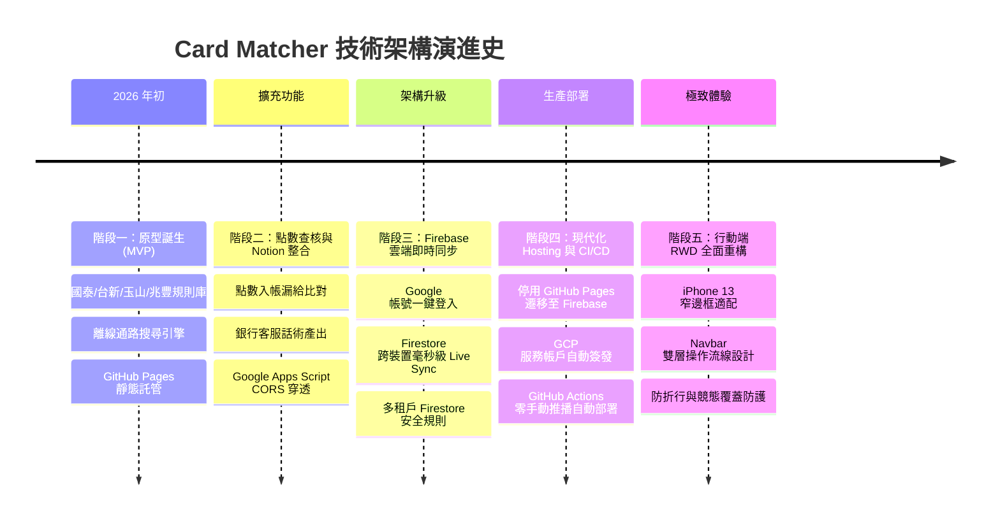

# 📖 2026 信用卡方案速查系統：從 0 到 1 完整開發歷程與架構演進史 (Development Journey)

> 本文件完整記錄《2026 信用卡最佳方案與點數查核中心 (Card Matcher)》從最初構想、原型建置、技術瓶頸突破、架構演進至現代化雲端 CI/CD 的全流程。

---

## 🧭 專案演進里程碑總覽 (Milestones Timeline)

---

## 📑 第一階段：需求起源與前端原型 (MVP)

### 1.1 背景痛點
- 2026 年台灣主流權益切換型信用卡（國泰世華 CUBE 卡、台新 Richart 卡、玉山 UBear、兆豐宇宙明星 BT21）權益複雜。
- 使用者在結帳當下無法即時得知哪張卡回饋最高、當天方案是否需切換。

### 1.2 技術選型與實作
- **核心架構**：原生現代 JavaScript (ES Modules) + Vanilla CSS + Vite。
- **資料層**：建立結構化特約店家與權益規則資料庫（`src/js/cards-data.js`）。
- **推薦演算法**：
  - 輸入店家關鍵字（如「博客來」、「全聯」、「UberEats」）。
  - 自動比對所有持卡方案，計算即時回饋率，並提示「今日方案鎖定狀態」。
- **初期託管**：使用 GitHub Pages（`tommy95271.github.io/card-matcher`）進行快速靜態展示。

---

## 📝 第二階段：點數對帳需求與 Notion 資料庫整合 (Mode 3)

### 2.1 痛點：銀行點數常常漏給、少算
- 方案回饋通常於刷卡後數日或次月入帳，使用者經常忘記當初是切換成何種方案消費，導致權益縮水卻渾然不知。

### 2.2 創新設計：點數查核與客服申訴話術
1. **記帳與試算引擎**：記錄「消費金額」、「適用方案」、「預期回饋點數」（小樹點、台新Point、現金回饋）。
2. **查核三態**：`🟡 待核對` ➔ `🟢 已入帳` ➔ `🔴 漏給需申訴`。
3. **自動申訴文案生成器**：比對官方公告與漏給差額，自動產出可直接複製寄給銀行客服的申訴話術。

### 2.3 技術瓶頸與解決方案：Notion API 與 CORS 限制
- **問題**：瀏覽器前端因 CORS 限制無法直接呼叫 Notion 官方 API；且一般使用者不願意自行架設 Node.js 伺服器。
- **解決方案（Universal Notion GAS Relay）**：
  - 開發 Google Apps Script (GAS) Serverless 中繼後端（`gas-backend/Code.gs`）。
  - 提供公開 Webhook 端點，支援前端動態傳入 `notionApiKey` 與 `notionDbId`。
  - 實作「智慧網址解析」：使用者直接貼上 Notion 完整資料庫 URL，系統自動正則萃取 32 位元 Database ID。
  - 支援 `add_expense`、`update_status`、`delete_expense` 與 `fetch_expenses` 全生命週期連動。

---

## 🔥 第三階段：零設定多裝置雲端即時同步 (Mode 2)

### 3.1 痛點：免設 Notion Key 的大眾用戶同步需求
- 部份一般使用者不熟悉 Notion API Token 的申請流程，但仍需要手機、平板、電腦無縫同步帳本。

### 3.2 Firebase Authentication + Cloud Firestore 架構
- **Google 一鍵登入**：串接 Firebase Client SDK，登入即用。
- **即時雙向監聽（Live Sync）**：
  - 使用 Firestore `onSnapshot` 監聽 `users/{uid}/expenses` 集合，任何裝置新增、修改或刪除，其餘裝置毫秒級自動更新。
- **離線優先與自動遷移**：
  - 未登入前的本機紀錄，於登入瞬間自動透過 Firestore Batch 遷移至雲端。
- **多租戶安全防護**：
  - 撰寫嚴格的 `firestore.rules`，限制僅有本人 (`request.auth.uid == userId`) 具備讀寫權限。

### 3.3 核心技術攻堅：競態條件（Race Condition）與雙向 ID 持久化
- **問題**：Firestore 快速同步會覆蓋正在等待 Notion 回傳的 `notionPageId`，導致後續「修改狀態」與「刪除」無法對應到 Notion 卡片。
- **修復機制**：
  1. Firestore Live Sync 合併時加入保護鎖，絕不以遠端空值覆蓋本機已存在的 `notionPageId`。
  2. Notion 建立完成後立即回寫更新 Firestore 節點。
  3. 修改狀態時若發現無 ID，觸發智慧補償同步，確保雙向資料庫 100% 一致。

---

## 🚀 第四階段：生產架構遷移與 GitHub Actions CI/CD (Mode 4)

### 4.1 為什麼從 GitHub Pages 遷往 Firebase Hosting？
| 比較面向 | GitHub Pages (舊) | Firebase Hosting (新) |
| :--- | :--- | :--- |
| **網域名稱與品牌** | 子目錄 `/card-matcher/`（易有 SPA 路由 base 錯誤） | 獨立專屬網域 `card-matcher-2026.web.app` |
| **全端生態系** | 僅支援靜態檔案託管 | 與 Firebase Auth / Firestore 同屬一體，極速同源存取 |
| **CDN 快取與速度** | 基礎全球快取 | Google 全球 Edge CDN 加速與自動 SSL 證書管理 |
| **PWA 與快取支援** | 需手動調整 Service Worker 路徑 | 原生支援 Root Scope 與乾淨 URL Rewrites |

### 4.2 GitHub Actions ⇄ Firebase Hosting 自動化部署管道
- 移除舊的 `deploy.yml`（GitHub Pages）。
- 建立 Google Cloud IAM 服務帳號（`firebase-adminsdk-fbsvc`），簽發私密金鑰並以 Libsodium 加密寫入 GitHub Secrets（`FIREBASE_SERVICE_ACCOUNT_CARD_MATCHER_2026`）。
- 建立 `.github/workflows/firebase-hosting-merge.yml`：
  - 只要 `git push origin main`，GitHub Actions 雲端虛擬機全自動執行 `npm ci` ➔ `npm run build` ➔ `Firebase Hosting Deploy`。

---

## 📱 第五階段：行動端 RWD 極致適配 (iPhone 13 窄螢幕最佳化)

### 5.1 痛點分析
- iPhone 13（寬度 390px）等行動裝置在直向瀏覽時：
  - 頂部導覽列按鈕過多，將左側「信用卡方案速查」標題擠壓成垂直單字折行。
  - 右側工具列超出螢幕，造成 X 軸橫向溢出滑動。
  - 卡片內「👑 首選推薦卡片」與「⚡ 記一筆」按鈕文字折行。

### 5.2 響應式佈局重構方案
1. **Header 雙層流線設計**：
   - **第一層**：品牌標題（鎖定 `white-space: nowrap`）＋ Google 帳號頭像 ＋ 深淺色切換 🌙 ＋ 設定 ⚙️。
   - **第二層**：全寬重點操作按鈕列 📊「對帳查核中心」與 ➕「記一筆」，提供宛如 iOS 原生金融 App 的觸控體驗。
2. **防折行排版（Nowrap Protection）**：
   - 所有標籤與按鈕全面加入 `flex-shrink: 0` 與 `white-space: nowrap`，徹底根除跑版問題。

---

## 🎯 架構決策記錄 (Architecture Decision Records, ADR)

### ADR-001: 為什麼選擇 Google Apps Script 作為 Notion Relay？
- **背景**：Notion API 不允許瀏覽器直接跨域請求（CORS 限制）。
- **決策**：採用 Google Apps Script Web App。
- **效益**：
  - 免費、零伺服器維護成本、高可用性。
  - 能安全地在伺服器端調用 Notion REST API，完美支援所有手機與電腦瀏覽器。

### ADR-002: 為什麼採用雙軌同步策略（Firestore + Notion）？
- **背景**：一般用戶追求「0 門檻跨裝置同步」，進階用戶追求「資料完全掌握在自己的 Notion」。
- **決策**：設計可獨立亦可共存的雙軌架構。
- **效益**：
  - 登入 Google 即可享有 Firestore 即時多裝置同步。
  - 設定 Notion 即可備份至私人筆記庫。
  - 兩者同時開啟時，系統無縫並行雙向寫入。

---

## 📊 專案關鍵資源與連結

- 🌐 **線上產品環境**：[https://card-matcher-2026.web.app](https://card-matcher-2026.web.app)
- 🐙 **GitHub 原始碼庫**：[Tommy95271/card-matcher](https://github.com/Tommy95271/card-matcher)
- ⚡ **Google Apps Script 後端原始碼**：[`gas-backend/Code.gs`](file:///d:/Personal/Cards/card-matcher/gas-backend/Code.gs)
- 🔒 **Cloud Firestore 安全規則**：[`firestore.rules`](file:///d:/Personal/Cards/card-matcher/firestore.rules)
- ⚙️ **CI/CD 自動化部署設定**：[`.github/workflows/firebase-hosting-merge.yml`](file:///d:/Personal/Cards/card-matcher/.github/workflows/firebase-hosting-merge.yml)
